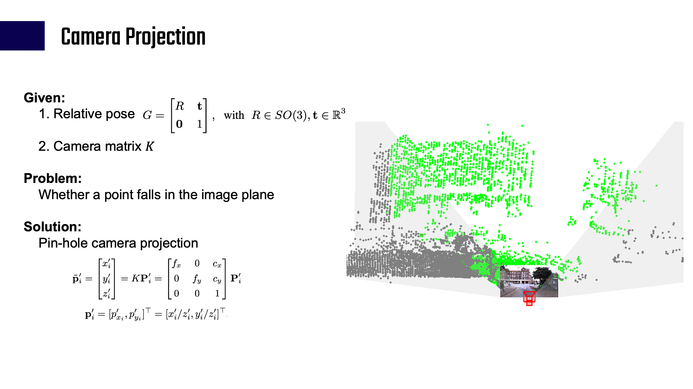
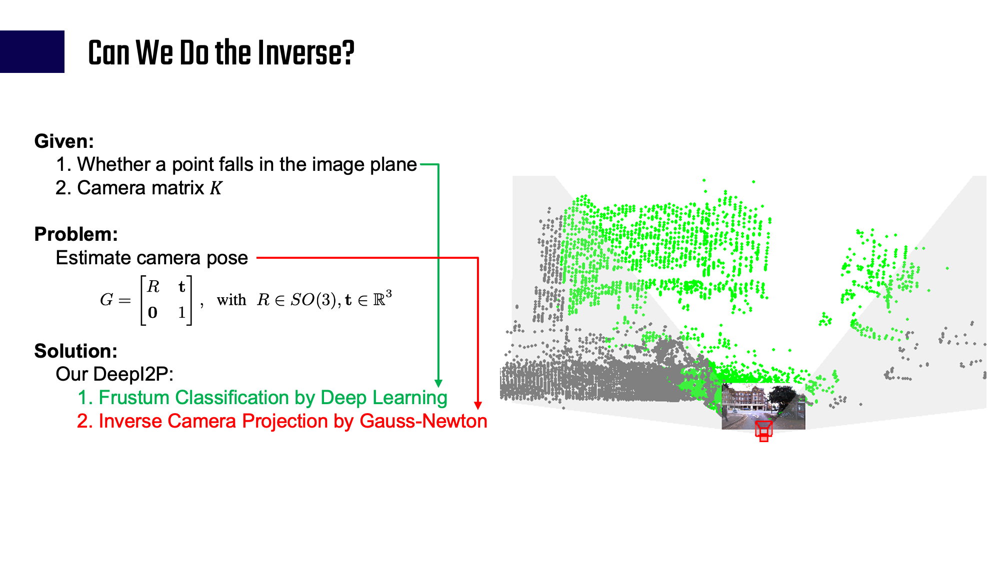

#DeepI2P: Image-to-Point Cloud Registration via Deep Classification
## Summary
### [Video](resources/deepi2p-cvpr2021-compressed.mp4)
PyTorch implementation for our CVPR 2021 paper DeepI2P. DeepI2P solves the problem of cross modality registration, i.e, solve the relative rotation `R` and translation `t` between the camera and the lidar.

DeepI2P: Image-to-Point Cloud Registration via Deep Classification<br>
[Jiaxin Li](https://www.jiaxinli.me/) <sup>1</sup>,
[Gim Hee Lee](https://www.comp.nus.edu.sg/~leegh) <sup>2</sup> <br>
<sup>1</sup>ByteDance, <sup>2</sup>National University of Singapore  

### Method
The intuition is to perform the ``Inverse Camera Projection``, as shown in the images below.



## Repo Structure
- `data`: Generate and process datasets
- `evaluation`: Registration codes, include Inverse Camera Projection, ICP, PnP
  - `frustum_reg`: C++ codes of the Inverse Camera Projection, using Gauss-Newton Optimization. Installation method is shown below. It requires the [Ceres Solver](http://ceres-solver.org/). 
  ```
  python evaluation/frustum_reg/setup.py install
  ```
  - `icp`: codes for ICP (Iterative Closest Point)
  - `registration_lsq.py`: Python code for Inverse Camera Projection, which utilizes the per-point coarse classification prediction, and the `frustum_reg` solver.
  - `registration_pnp.py`: Python code for PnP solver utilizing the per-point fine classification prediction.
- `kitti`: Training codes for KITTI
- `nuscenes`: Training codes for nuscenes
- `oxford`: Training codes for Oxford Robotcar dataset
- `models`: Networks and layers
  - 'index_max_ext': This is a custom operation from [SO-Net](https://github.com/lijx10/SO-Net), which is the backbone of our network. Installation:
  ```
  python models/index_max_ext/setup.py install
  ```
  - `networks_img.py`: Network to process images. It is a resnet-like structure.
  - `networks_pc.py`: Network to process point clouds, it is from [SO-Net](https://github.com/lijx10/SO-Net)
  - `network_united.py`: Network to fuse information between point clouds and images.

## Dataset and Models
- [Oxford train/test split and evaluation dataset](https://drive.google.com/drive/folders/1MVNDGCRXVjC-hxtW_mg4abMXmtpNVzLR?usp=sharing)
- [Oxford coarse classification model](https://drive.google.com/drive/folders/1rycR7xtptDA9gqh-p4n5AsZtu0d3iKsC?usp=sharing)
- [Oxford coarse \& fine classification model](https://drive.google.com/drive/folders/1lzbI1PjmqmmdiVYGgkSB1yo7-7vnW9f4?usp=sharing)


